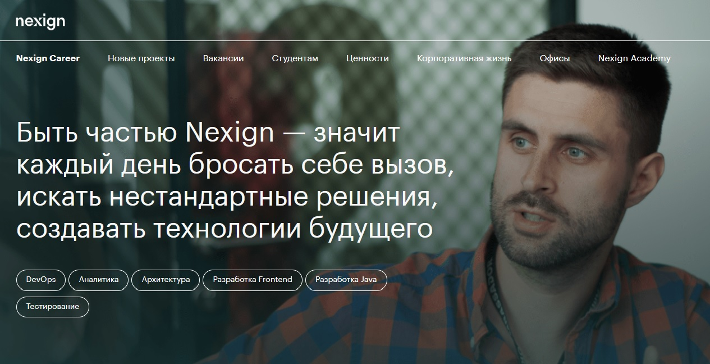

# Проект по тестированию главной страницы сайта "Nexign. Nexign Career"
> <a target="_blank" href="https://job.nexign.com/">Ссылка на Nexign Career</a>

#### Список проверок, реализованных в автотестах
- [x] Наличие требуемых заголовков в верхнем меню страницы
- [x] Наличие блока подписки на социальные сети в подвале сайта
- [x] Наличие имиджевого текста на первой странице
- [x] Выполнение поиска заданной вакансии. Проверка, что открылась соответствующая страница и содержимое строки поиска соответствует заданному
#### Список проверок ручного тестирования
- [x] Визуальная характеристика главной страницы сайта, соответствие единому корпоративному стилю
- [x] Адаптивность вёрстки
- [x] Соответствие вёрстки сайта общепринятым стандартам

## Проект реализован с использованием

# Запуск автотестов выполняется на сервере Jenkins
> <a target="_blank" href="https://jenkins.autotests.cloud/job/TevikFX-nexign-job-test/">Ссылка на проект в Jenkins</a>

### Параметры сборки

* login (default user1)
* password (default 1234)
* test_group (default ui_tests). Параметр определяет группу тестов для запуска.

